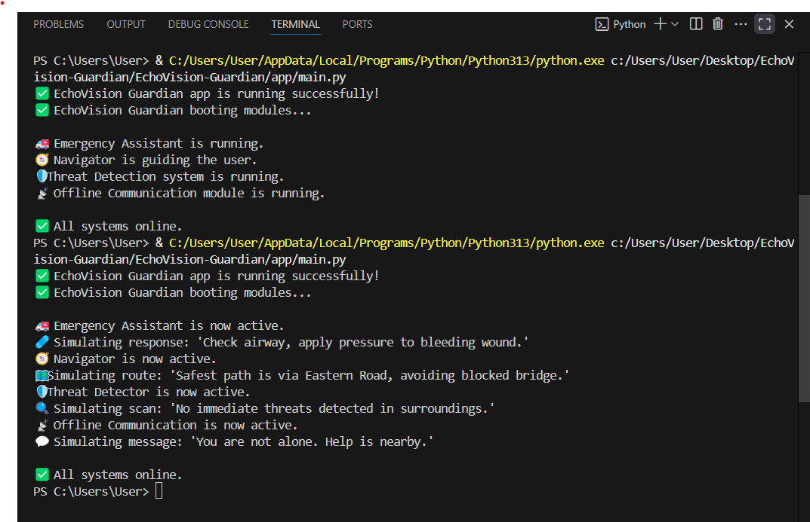

# EchoVision Guardian 🛡️

**A multimodal offline-ready survival AI built for crises.**  
Runs on Gemma 3n and handles first aid, threat detection, route navigation & offline communication — even when internet and infrastructure fail.

---

## 🚀 Features

- 🚑 Emergency First Aid Assistant (text/audio)
- 🛡️ Threat Detection (camera input)
- 🧭 Crisis-safe Navigator (offline map logic)
- 📡 Offline Communication Simulation
- ⚙️ Runs offline (fully local, no cloud needed)

---

## 💻 How to Run

```bash
# 1. Clone the repo
git clone https://github.com/TachyonFermion512/EchoVision-Guardian.git
cd EchoVision-Guardian

# 2. Install dependencies
pip install -r requirements.txt

# 3. Run the app
cd app
python main.py

---

## 🖼️ Preview




